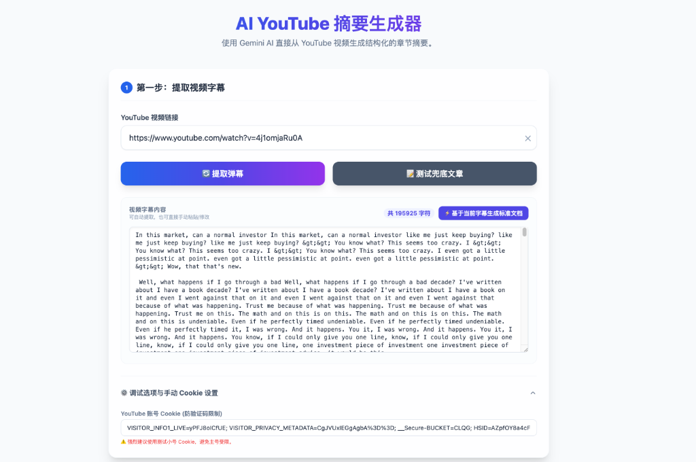
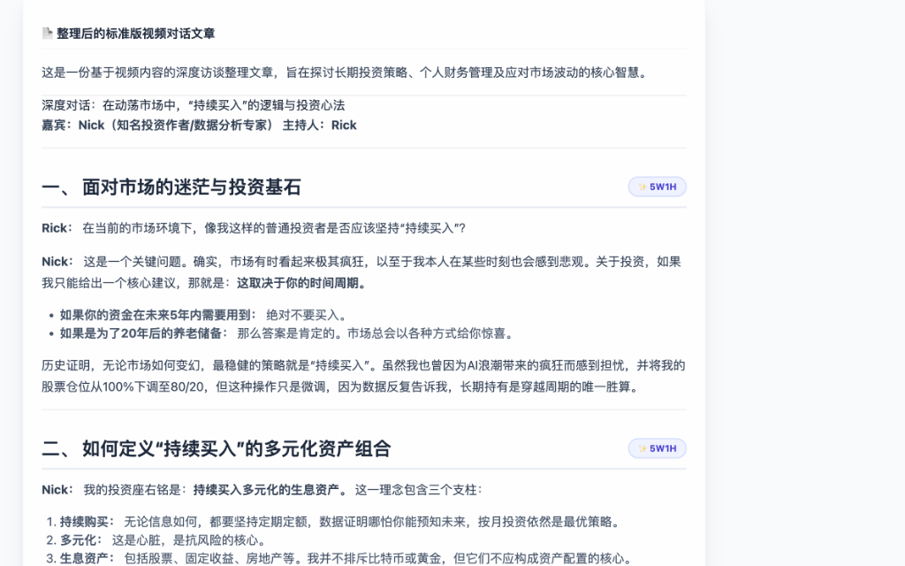
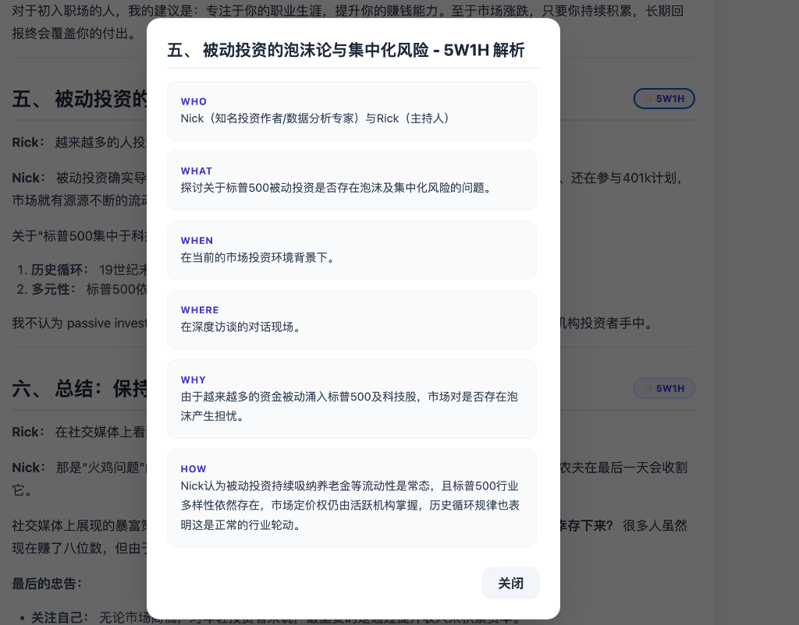
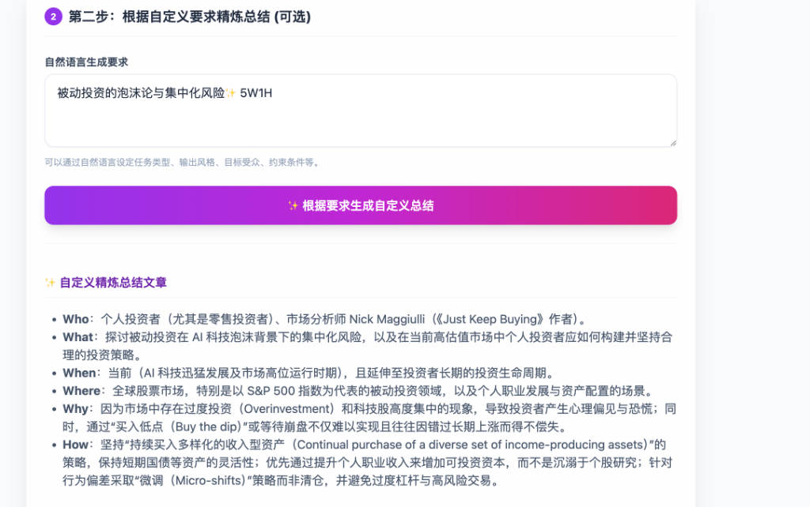
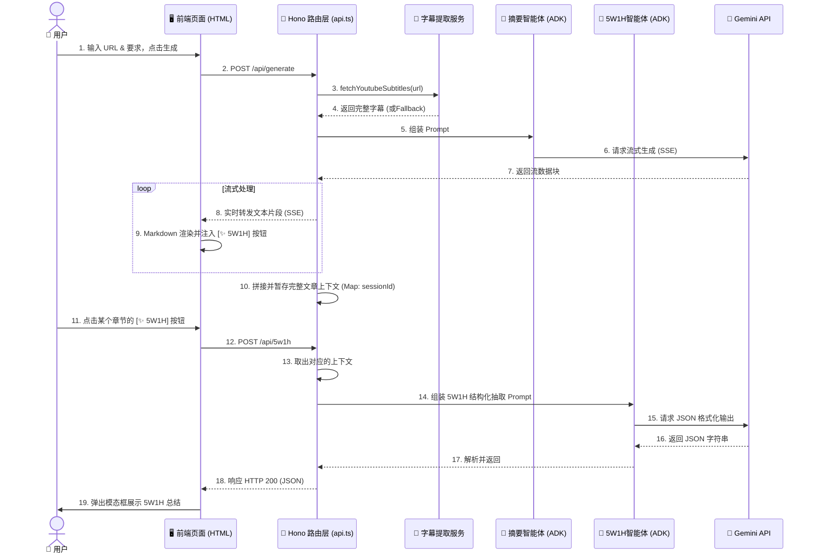

# AI YouTube Summarizer (Cloudflare Worker)

这是一个基于 Cloudflare Workers 和 Gemini AI Studio 构建的 YouTube 视频摘要与 5W1H 总结应用。
本项目已基于 **模块化架构 (Modular Design)** 重构，并集成了 **Google Agent Development Kit (@google/adk)** 的架构思想来拆分智能体职责。

## 📸 效果展示 (Demo)





## 部署的公开访问网址与 GitHub 地址

*   **部署网址**: [待部署时生成 - e.g., https://ai-youtube-summarizer.your-username.workers.dev]
*   **GitHub 仓库**: [用户自行上传后的地址]

## 测试参考信息

为了方便快速测试我们的应用功能，您可以使用以下测试视频与配套 Cookie：

*   **测试 YouTube 视频**: `https://www.youtube.com/watch?v=4j1omjaRu0A`
*   **测试 Cookie (避免验证码)**:
    ```text
    [如果提取失败，请在此处填入您自己的 YouTube 测试 Cookie]
    ```

## 工程说明文档

### 架构与流程图

系统采用清晰的职责分离（Service-Router-Agent）架构：



### 1. 模块化设计与 ADK 集成
为了让系统具备长期的可扩展性，我们从单体脚本重构为了典型的 MVC / 智能体模式，并引入了 `@google/adk` 的生态基建（包括 TypeScript 环境的完善与 `nodejs_compat` 模式开启）：
- **`src/services/youtubeService.ts`**: 专注数据层，负责网络请求提取字幕与降级容错。
- **`src/agents/summaryAgent.ts`**: 专注宏观总结生成，将复杂的用户意图与视频字幕融合，暴露出流式对接口。
- **`src/agents/w5h1Agent.ts`**: 专注细粒度信息抽取，强约束 Gemini 仅输出标准的 5W1H 结构化 JSON。
- **`src/routes/api.ts`**: 路由分发器，将 Hono HTTP 请求桥接给下层的 Service 和 Agent。

### 2. 如何获取和处理 YouTube 字幕与弹幕
为了保障能够极速且稳定地提取到 YouTube 字幕（弹幕），我们不仅支持常规的 `ytInitialPlayerResponse` 解析，还专门增加了两项核心抗风控机制：
- **代理池 (Proxy Pool) 支持**：通过在环境变量中配置多个高匿代理节点 IP，我们在发起 YouTube 请求时会进行随机打乱和节点重试。一旦某个节点被 YouTube 限流或封锁，系统会自动切换到下一个代理节点尝试。这大幅提升了获取字幕的可用率。
- **Cookie 鉴权方式**：针对某些限制严格的视频，我们支持在前端界面注入 YouTube 账户的 Cookie。通过携带真实的访客鉴权信息（特别是 `VISITOR_INFO1_LIVE` 和 `SID` 等），我们能够像真实用户一样无缝绕过各类“人机验证 (Captcha)”拦截，确保每次字幕提取的成功率。

如果网络环境极端恶化，系统还会无缝降级返回一份测试长字幕，保障了业务流程高可用。

### 3. 如何调用 Gemini 并实现流式输出
由 `summaryAgent` 提供组装完毕的 Prompt 和请求端点。Hono 层拦截到 API 请求后，通过 Cloudflare Worker 的 `fetch` 建立持续连接，并利用 `hono/streaming` 的 `streamSSE` 方法逐块 (chunk) 读取 Gemini 返回的 SSE 数据。前端 `html.ts` 通过原生的浏览器流解析持续将文本交由 `marked.js` 渲染。

### 4. 如何根据用户生成要求影响输出结果
前端页面提供“自然语言要求”输入框（如“风格幽默、面向初学者”）。`summaryAgent` 接收到这个参数后，会利用模板字符串（Template Literal）将自然约束强制植入 System Prompt 区域。不论用户的输入多么个性化，模型都会将之视作最优先的规则进行服从。

### 5. 如何实现章节级 5W1H 总结
由 `w5h1Agent` 承接抽取任务。系统在主文章流式生成完毕时，在 Worker 内存的 `Map` 暂存了一份完整的生成文本作为 Context。前端点击章节按钮时只需轻量回传章节名。后端合并 Context 与章节焦点，强行注入 `generationConfig: { responseMimeType: "application/json" }` 和 JSON 模板约束，让大模型输出严格的 `{ "Who": "..." }` 数据结构给前端渲染。

---

## 本地开发与部署

1. **环境安装** (已包含 `@google/adk` 及依赖):
   ```bash
   npm install
   ```

2. **配置 API Key**:
   打开 `.dev.vars` 填入您的 Gemini API Key：
   ```env
   GEMINI_API_KEY="AIzaSyYourApiKeyHere..."
   ```

3. **本地开发预览**:
   由于引入了依赖 Node 的 ADK，目前已开启 `nodejs_compat` 标志。
   ```bash
   npm run dev
   ```

4. **部署到 Cloudflare**:
   ```bash
   npm run deploy
   ```

---

## 🚀 未来展望 (Future Roadmap)

这个项目目前已经具备了非常扎实的字幕提取与大模型结构化总结能力。基于现有的模块化架构（Service-Router-Agent），未来还可以向以下几个方向持续迭代与拓展：

1. **多平台视频支持 (Multi-platform)**：
   - 将信息提取服务（Service层）从 YouTube 扩展到更多平台（如 Bilibili、Podcast 播客录音、Twitter 视频等），打造成一个全网泛视频内容分析终端。
2. **基于 RAG 的“与视频对话” (Chat with Video)**：
   - 接入向量数据库（如 Cloudflare Vectorize 或 Pinecone）。对动辄几小时的长视频字幕进行分块 (Chunking) 与向量化 (Embedding)，允许用户针对视频里的极长篇细节进行多轮问答对话。
3. **精准时间戳跳转 (Timestamp Deep-linking)**：
   - 在生成的结构化摘要或 5W1H 详情中，强制模型携带原始字幕对应的时间戳。前端点击这些句子，即可让内嵌的 YouTube 播放器无缝跳转至该时间点播放。
4. **可视化思维导图 (Mind Map Generation)**：
   - 结合大模型优秀的结构化抽取能力，前端集成可视化渲染库（如 Markmap 或 Mermaid.js），将视频逻辑结构一键生成树状思维导图。
5. **打通第二大脑生态 (Export & Integration)**：
   - 增加一键导出到 Notion、Obsidian 工作流的功能，形成“自动抓取 - 大模型精炼 - 自动归档”的知识沉淀闭环。
6. **多模态能力介入 (Multimodal Analysis)**：
   - 未来的 Agent 不仅读取字幕，还能直接抽取视频关键帧交由 Gemini 视觉大模型进行分析，从而连图表、板书也能被完美总结。
